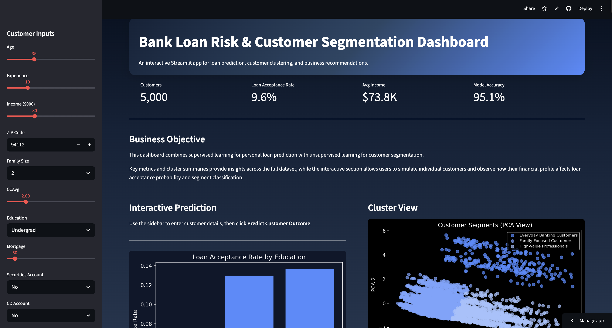

# Bank Loan Risk & Customer Segmentation Dashboard

An interactive analytics dashboard built with Streamlit that combines machine learning and customer segmentation to support loan decision-making and targeted marketing strategies.

------

# Overview

This project uses:

- Uses supervised learning to predict loan acceptance probability  
- Uses unsupervised learning to segment customers into distinct groups  
- Provides an interactive simulation for real-time customer input, prediction, and recommendations. 

My goal is to demonstrate how data-driven insights can improve financial decision-making and customer targeting.

------

# Live Demo
    [View the Dashboard] (https://bankloanriskdasboarddeploy-rcnpaeeqwqhbrrxsj86zot.streamlit.app/#bank-loan-risk-and-customer-segmentation-dashboard)

------

# Features

- **KPI Dashboard**
  Key metrics including customer count, loan acceptance rate, average income, and model accuracy  

- **Loan Prediction Tool**  
  Interactive input system to simulate customer profiles and predict loan outcomes for specific people with specific situations.

- **Customer Segmentation (Clustering)**  
  PCA-based visualization of customer groups  

- **Data Visualizations**  
  - Loan acceptance trends by education  
  - Cluster distribution (scatter plot)  

- **Strategic Recommendations**  
  Business-focused insights from model outputs  

------

# Models Used

- Logistic Regression (Loan Prediction)
- K-Means Clustering (Customer Segmentation)
- PCA (Dimensionality Reduction for visualization)

------

# Tech Stack

- Python  
- Streamlit  
- scikit-learn  
- pandas  
- matplotlib  

------

# Preview

markdown


------

# How to Run Locally

1. Clone the repository:

    ```bash
    git clone https://github.com/your-username/your-repo-name.git
    cd your-repo-name

2. Install the requirements:
    pip install -r requirements.txt

3. Run the app:
    streamlit run app.py

------

# Key Insights
- Higher-income customers show a much higher chance of a loan acceptance
- Customer segmentation shows distinct financial behavior patterns
- Combining prediction and clustering allows for more targeted decision-making with the support of added risk knowledge

------

# Purpose
This project was built as part of a data analytics portfolio to demonstrate:
- End-to-end data workflow (data → model → insights → UI)
- Ability to translate data into business value
- Experience building interactive analytical tools

------

# Author
Beverly Ajuzie
Computer Science (Data Analytics) Student @ UTSA
Aspiring Data Analyst